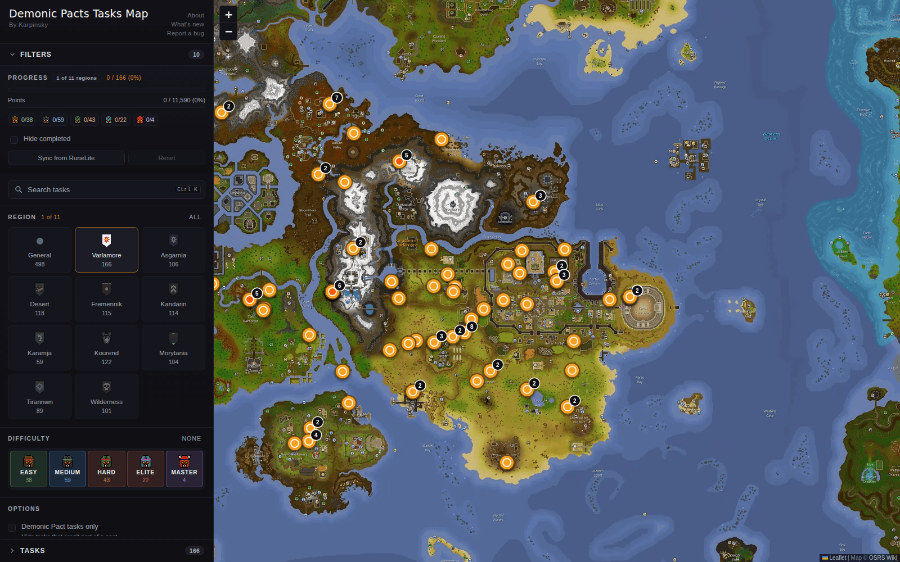
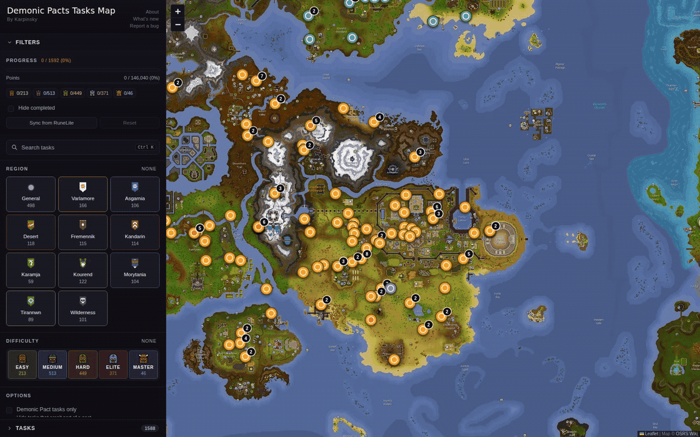

# LeaguesMap

LeaguesMap is an interactive map for Old School RuneScape's Demonic Pacts league, built with React, TypeScript, Vite, and Leaflet. It pins 1,177 of the league's 1,592 tasks to a tiled world map; the rest stay in a searchable list. You can filter pinned and list-only tasks by region, difficulty, skill, and pact. You can mark tasks complete or import progress from RuneLite; filters and progress stay in your browser's local storage. Live at https://leagues-map.karpinsky.io.



Filter to Varlamore, open a task pin, and mark a task complete:



[1440px desktop](docs/desktop-1440.png) · [390px mobile map](docs/mobile-390.png) · [390px mobile filters](docs/mobile-filters-390.png)

## Run locally

Use Node.js 22.22.3 or newer in the Node 22 LTS line, with npm 10 or newer.

```sh
git clone https://github.com/EKarpinsky/LeaguesMap.git
cd LeaguesMap
npm ci
npm run dev
```

Open the URL Vite prints, normally http://localhost:5173. No API key or external service is needed to browse the map or import progress. The `predev`, `pretest`, and `prebuild` scripts generate runtime task and location data automatically from the checked-in data.

```sh
npm run lint
npm test
npm run build
npm run preview
```

`npm run preview` serves the static build. `npm run dev` also serves `/api/report-bug` through the Vite development bridge. Without an email key, `POST /api/report-bug` returns HTTP 500 with `{"error":"Email backend not configured"}`. For local email testing, export `RESEND_API_KEY` in the shell before starting Vite. Sending a report with a valid key sends a real email.

## Regenerate the demo

With FFmpeg, ffprobe, and Playwright Chromium installed, run these commands in separate terminals after building to save screenshots and a GIF in `docs/`.

```sh
npm run preview -- --host 127.0.0.1 --port 4173 --strictPort
```

```sh
npm run capture:demo
```

## Why the calibration is piecewise

The wiki world map is a stitched image, with the western continent separated from the mainland by a wider ocean gap than a uniform coordinate scale predicts. A single affine fit put western pins roughly 50 to 80 game tiles away from their landmarks. The calibration uses separate segment origins and was refined against hand-measured landmarks, reducing the worst western horizontal error from 189 to 61 pixels. `src/lib/calibration.ts` documents the fit, and `scripts/verify-calibration.ts` records the reference landmarks and checks coordinate round trips.

## Import progress from RuneLite

In RuneLite's Tasks Tracker plugin, export your Demonic Pacts progress to JSON. Open **Sync from RuneLite** in LeaguesMap and paste the export or select the file. The browser decodes the export's 62 player-variable bitfields into task IDs and applies the completed tasks locally. It does not send the export to a backend or call the WikiSync API.

## Hosting

- Build command: `npm run build`.
- Build output directory: `dist`.

| Variable | Where | Purpose |
| --- | --- | --- |
| `RESEND_API_KEY` | Project environment variables | Enables bug-report email. Bug reports are disabled without it. Never prefix this secret with `VITE_`. |
| `RESEND_FROM` | Project environment variables | Optional verified sender. Default: `LeaguesMap <onboarding@resend.dev>`. |
| `REPORT_BUG_TO` | Project environment variables | Optional recipient. Default: `eli@karpinsky.io`. |

## Credits

This is an unofficial fan tool, not affiliated with Jagex. Old School RuneScape and its assets belong to Jagex; the map imagery and task data come from the OSRS Wiki.
